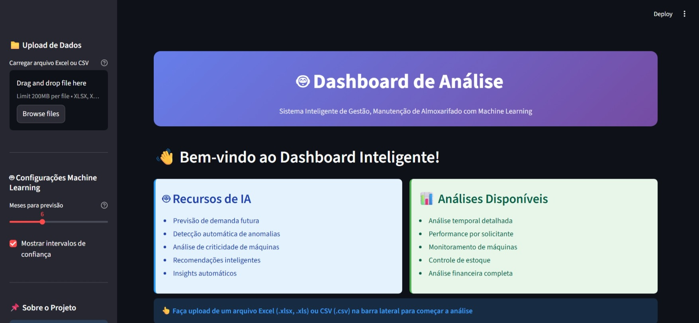
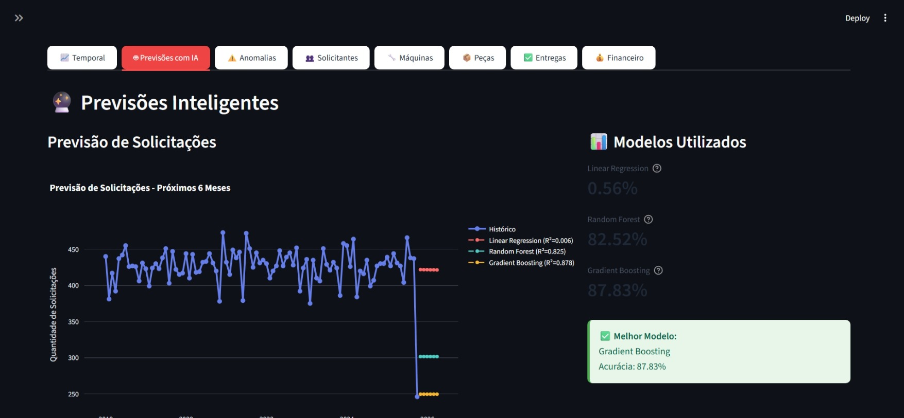
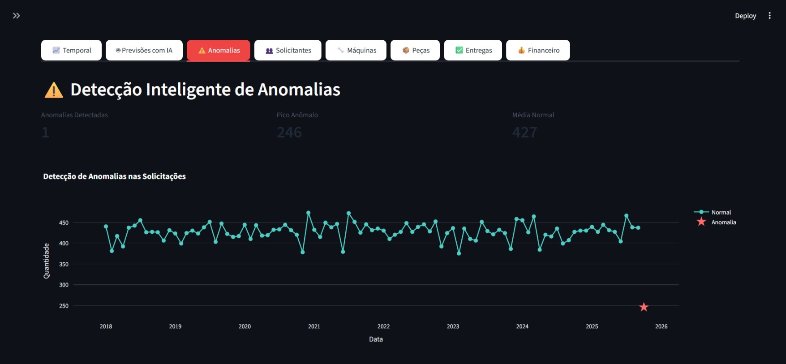

# 🤖 Dashboard de Análise de Almoxarifado com Machine Learning

> Sistema Inteligente de Gestão, Manutenção de Almoxarifado com Machine Learning

[](https://www.python.org/)
[](https://streamlit.io/)
[](https://scikit-learn.org/)
[](LICENSE)

## 📋 Sobre o Projeto

Dashboard inteligente desenvolvido para análise preditiva e gestão estratégica de almoxarifado industrial. O sistema utiliza técnicas avançadas de Machine Learning para prever demandas, detectar anomalias e otimizar processos de manutenção.

### ✨ Funcionalidades Principais

- 📈 **Análise Temporal**: Visualização detalhada da evolução de solicitações e custos ao longo do tempo
- 🔮 **Previsões com IA**: Modelos de Machine Learning para prever demandas futuras (3-12 meses)
- ⚠️ **Detecção de Anomalias**: Identificação automática de padrões anormais usando análise estatística
- 🎯 **Análise de Criticidade**: Classificação inteligente de máquinas por criticidade (Alta, Média, Baixa)
- 👥 **Gestão de Solicitantes**: Análise de performance e custos por solicitante
- 🔧 **Monitoramento de Máquinas**: Acompanhamento de manutenção por equipamento
- 📦 **Controle de Estoque**: Previsão de demanda de peças com taxa de consumo
- ✅ **Gestão de Entregas**: Acompanhamento de status e prazos
- 💰 **Análise Financeira**: Dashboards completos de custos e distribuição financeira

### 🤖 Modelos de Machine Learning

- **Linear Regression**: Análise de tendências lineares
- **Random Forest**: Previsões robustas com ensemble learning
- **Gradient Boosting**: Otimização de acurácia com boosting
- **Prophet (Meta)**: Séries temporais com sazonalidade

## 🛠️ Tecnologias Utilizadas

| Tecnologia | Versão | Descrição |
|------------|--------|-----------|
|  | 3.13+ | Linguagem principal |
|  | 1.50.0 | Framework web interativo |
|  | 2.3.3 | Manipulação de dados |
|  | 1.7.2 | Machine Learning |
|  | 1.1.5 | Previsões de séries temporais |
|  | 5.17.0 | Visualizações interativas |
|  | 1.26.4 | Computação numérica |

## 🚀 Como Executar

### Pré-requisitos

- Python 3.8 ou superior
- pip (gerenciador de pacotes Python)

### Instalação

1. **Clone o repositório**
```bash
git clone https://github.com/ksaworks/dashboard-almoxarifado.git
cd dashboard-almoxarifado
```

2. **Crie um ambiente virtual (recomendado)**
```bash
python -m venv venv
source venv/bin/activate  # No Windows: venv\Scripts\activate
```

3. **Instale as dependências**
```bash
pip install -r requirements.txt
```

4. **Execute a aplicação**
```bash
streamlit run app.py
```

5. **Acesse no navegador**
```
http://localhost:8501
```

## 📊 Estrutura do Projeto

```
dashboard-almoxarifado/
│
├── app.py                  # Aplicação principal Streamlit
├── ml_predictions.py       # Módulo de Machine Learning
├── requirements.txt        # Dependências do projeto
├── README.md              # Documentação
│
└── data/                  # Dados (não versionados)
    └── exemplo.xlsx       # Exemplo de estrutura
```

## 📁 Formato dos Dados

O sistema aceita arquivos Excel (.xlsx, .xls) ou CSV (.csv) com as seguintes colunas obrigatórias:

| Coluna | Tipo | Descrição |
|--------|------|-----------|
| `Mês/Ano` | String | Formato: MM-AAAA (ex: 01-2024) |
| `Solicitante` | String | Nome do solicitante |
| `2- Máquina de destino:` | String | Identificação da máquina |
| `6- Descrição da peça: ` | String | Descrição da peça solicitada |
| `7- Quantidade de peças.` | Número | Quantidade numérica |
| `Total` | Número | Valor total em R$ |
| `Entregue?` | String | Status da entrega (opcional) |

### Exemplo de Dados

```csv
Mês/Ano,Solicitante,2- Máquina de destino:,6- Descrição da peça: ,7- Quantidade de peças.,Total,Entregue?
04-2024,João Silva,Máquina A,Rolamento SKF 6205,2,150.50,Sim
05-2024,Maria Santos,Máquina B,Correia Dentada HTD,1,200.00,Sim
```

## 🎯 Casos de Uso

1. **Planejamento de Compras**: Previsão de demanda para próximos 3-12 meses
2. **Controle de Custos**: Análise financeira detalhada por máquina e período
3. **Manutenção Preditiva**: Identificação de máquinas com alta criticidade
4. **Gestão de Estoque**: Otimização de níveis de estoque baseado em consumo histórico
5. **Detecção de Problemas**: Alertas automáticos sobre padrões anormais

## 📈 Capturas de Tela

### Dashboard Principal


### Previsões com IA


### Análise de Anomalias


## 🔧 Configurações Avançadas

### Ajuste de Modelos

Os parâmetros dos modelos podem ser ajustados em `ml_predictions.py`:

```python
# Random Forest
RandomForestRegressor(n_estimators=100, random_state=42)

# Gradient Boosting
GradientBoostingRegressor(n_estimators=100, random_state=42)

# Prophet
Prophet(
    yearly_seasonality=True,
    weekly_seasonality=False,
    daily_seasonality=False,
    changepoint_prior_scale=0.05
)
```

## 🤝 Contribuindo

Contribuições são bem-vindas! Sinta-se à vontade para abrir issues ou enviar pull requests.

1. Fork o projeto
2. Crie uma branch para sua feature (`git checkout -b feature/AmazingFeature`)
3. Commit suas mudanças (`git commit -m 'Add some AmazingFeature'`)
4. Push para a branch (`git push origin feature/AmazingFeature`)
5. Abra um Pull Request

## 📝 Licença

Este projeto está sob a licença MIT. Veja o arquivo [LICENSE](LICENSE) para mais detalhes.

## 👨‍💻 Autor

**Kelvin Andrade**

- GitHub: [@ksaworks](https://github.com/ksaworks)
- LinkedIn: [Kelvin Andrade](https://www.linkedin.com/in/kelvinandradeworks/)

## 🙏 Agradecimentos

- [Streamlit](https://streamlit.io/) - Framework incrível para aplicações de dados
- [Scikit-learn](https://scikit-learn.org/) - Biblioteca essencial de Machine Learning
- [Prophet](https://facebook.github.io/prophet/) - Ferramenta poderosa de previsão
- [Plotly](https://plotly.com/) - Visualizações interativas de alta qualidade

---

⭐ Se este projeto foi útil para você, considere dar uma estrela no GitHub!

**Desenvolvido por Kelvin Andrade**